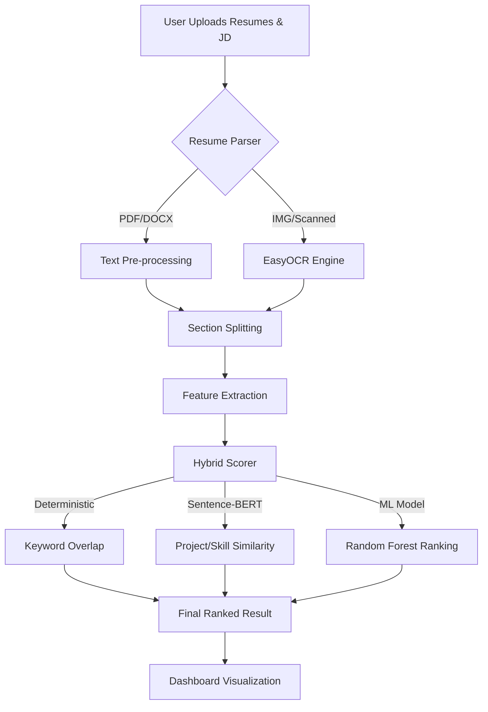

# HireFlow AI

> **AI-Powered Resume Screening & Ranking Pipeline** — Upload resumes, score candidates with ML, and find the right talent faster using semantic matching and predictive analytics.

Built by a team of CS students as a high-performance recruitment analytics platform.

 <!-- Placeholder for actual UI screenshot -->

---

## 🚀 Key Features (V2 Optimized)

### 🧠 Hybrid ML Scoring
The system uses a blended scoring formula that combines deterministic keywords with machine learning and NLP:
*   **Random Forest Classifier**: Trained on 1,100+ historical resume records to predict candidate suitability.
*   **Sentence-BERT (SBERT)**: Calculates cosine similarity between resumes and the Job Description (JD) for semantic mapping.
*   **Multi-Feature Scoring**: Weighted scoring based on skill overlap (22%), experience (13%), education quality (10%), and project relevance (15%).

### 📄 Multi-Format OCR Pipeline
High-accuracy text extraction handled via a sophisticated parsing engine:
*   **Supported Formats**: PDF, DOCX, DOC, and Images (PNG, JPG, BMP).
*   **OCR Support**: Integrated **EasyOCR** for scanned PDFs and image-based resumes.
*   **Section-Aware Extraction**: Automatically identifies sections for work, education, projects, and skills.

### 🎓 Education Quality & Project Analysis
*   **Degree Level Scoring**: PhD (1.0) to Diploma (0.4) scoring based on qualification.
*   **Field Relevance**: Bonus points for degrees matching the job domain.
*   **Project Relevance**: Individual projects are split and scored semantically against JD requirements.

### ⚛️ Premium UI Experience
*   **Animated Particle Background**: Ambience-enhancing interactive visualization in the dashboard.
*   **Glassmorphism Dashboard**: Modern dark-themed UI with real-time scoring visualizations.
*   **Anomaly Detection**: Automatic flagging of "keyword stuffing" or abnormally formatted resumes.

---

## 📊 Performance Metrics
The model is validated for high precision in candidate ranking:
- **Accuracy**: 95.12% on cross-industry test sets.
- **Inference Speed**: ~50ms per resume (leveraging JD embedding caching).
- **Cross-Validation**: 96.43% (5-fold) accuracy.

---

## 🏗️ Technical Architecture



---

## 🛠️ Tech Stack

### Frontend
- **Framework**: React 18 (Vite)
- **Styling**: Vanilla CSS (Custom Design System with Glassmorphism)
- **Animations**: Custom `ParticleBackground.jsx` implementation.
- **Tools**: Axios, React Router, Lucide-react.

### Backend
- **Engine**: Python 3.10+ (Flask)
- **Machine Learning**: `scikit-learn` (Random Forest), `sentence-transformers` (all-MiniLM-L6-v2)
- **NLP**: `numpy`, `pandas`, Cosine Similarity for semantic matching.
- **Parsing**: `PyMuPDF` (PDF), `python-docx` (DOCX), `mammoth` (DOC), `EasyOCR` & `Pillow` (Images).
- **Storage**: JSON-based persistent "Data Lake" for audit logs and training data.

---

## 🚀 Deployment (Vercel)

HireFlow AI is designed for easy deployment as a monorepo setup on **Vercel**.

### 1. Backend (Flask API)
The backend is ready for Vercel Serverless Functions.
*   **Vercel Config**: Already includes `backend/vercel.json` and `backend/wsgi.py`.
*   **Steps**:
    1. Import the repository to Vercel.
    2. Set the **Root Directory** to `backend`.
    3. Install dependencies automatically via `requirements.txt`.

### 2. Frontend (Vite App)
*   **Command**: `npm run build`
*   **Output Directory**: `dist`
*   **Environment Variables**:
    *   Set `VITE_API_URL` to your Vercel backend URL (e.g., `https://your-api.vercel.app`).
    *   Vite will automatically use this URL when building the production app.

---

## ⚙️ Local Setup (Windows Recommended)

### Quick Start (Unified Launcher)
1. **Prerequisites**: Python 3.10+ and Node.js 18+.
2. **Setup**:
   ```bash
   pip install -r backend/requirements.txt
   cd frontend && npm install && cd ..
   ```
3. **Launch**:
   ```bash
   python start.py
   ```
   *This starts both the Flask backend (5001) and Vite backend (5173).*

---

## 📂 Project Structure

```text
hireflow-ai/
├── backend/
│   ├── app.py              # Main API Orchestration
│   ├── resume_features.py  # Central Feature Extraction (DRY)
│   ├── candidate_scorer.py # ML Inference pipeline
│   ├── train_model.py      # ML Training Pipeline
│   ├── resume_parser.py    # Multi-format parsing & OCR
│   ├── model.pkl           # Trained RF model
│   └── vercel.json         # Serverless configuration
├── frontend/
│   ├── src/
│   │   ├── components/     # UI Components (ParticleBackground, etc.)
│   │   ├── config.js       # Production API configuration
│   │   └── pages/          # Dashboard, Result views
│   └── vite.config.js
├── scripts/
│   └── start.py            # Unified launcher
└── docs/
    └── assets/             # UI Screenshots and Architecture assets
```

---

*HireFlow AI © 2026*
